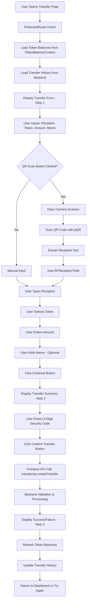
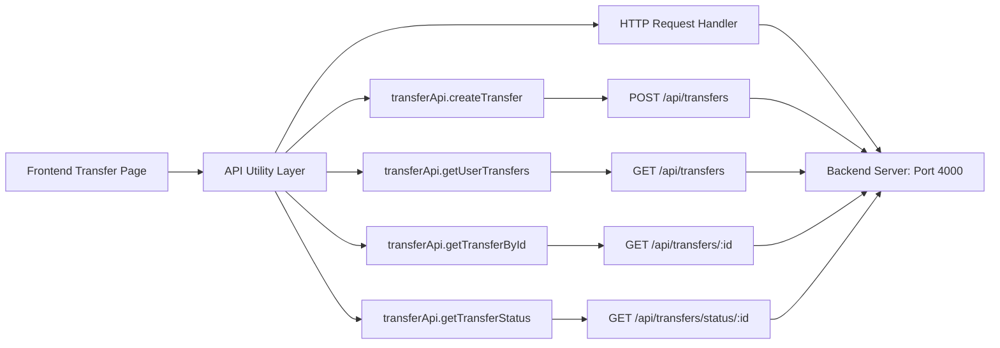
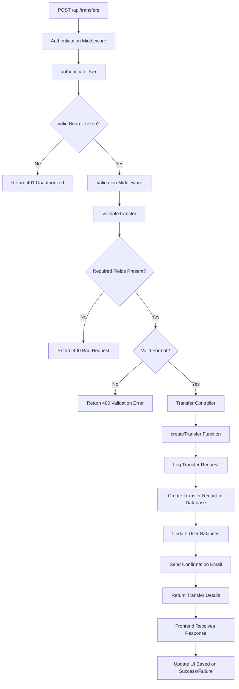
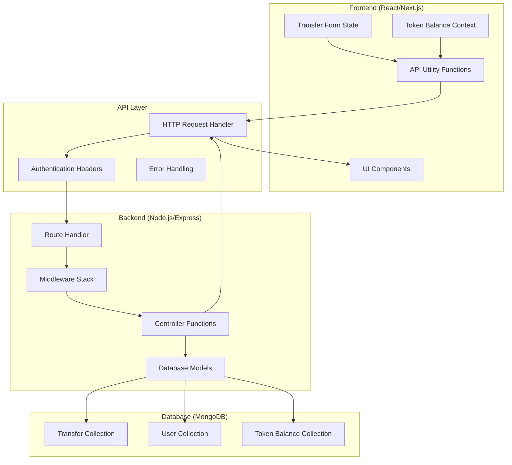
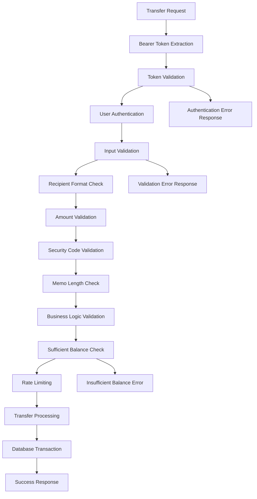
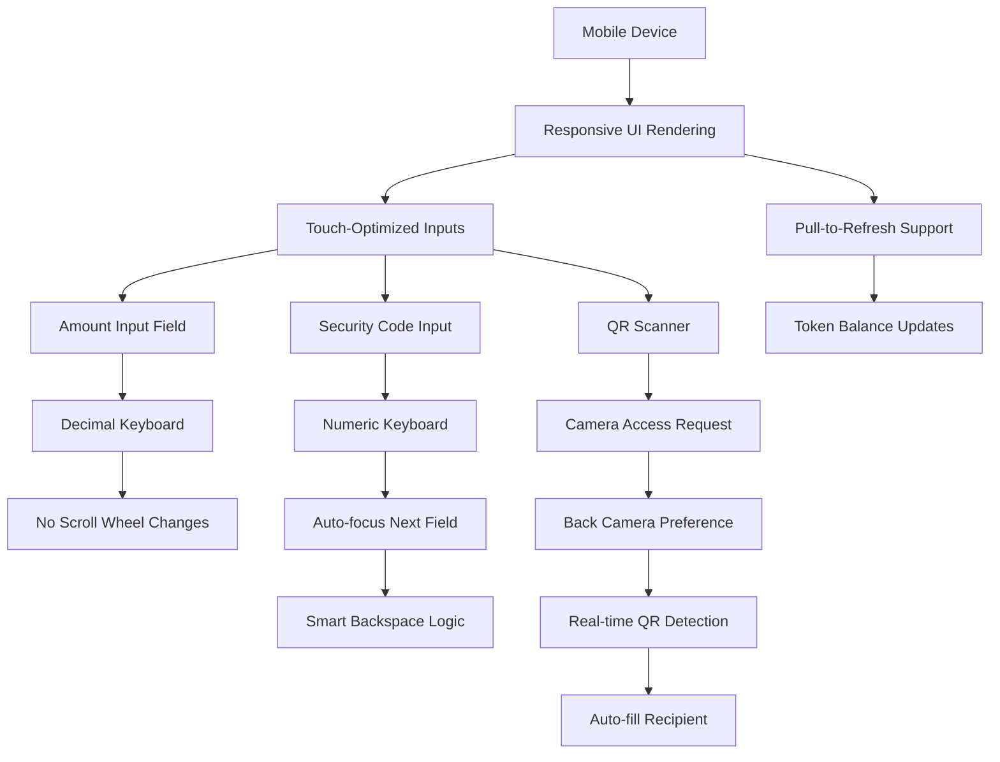
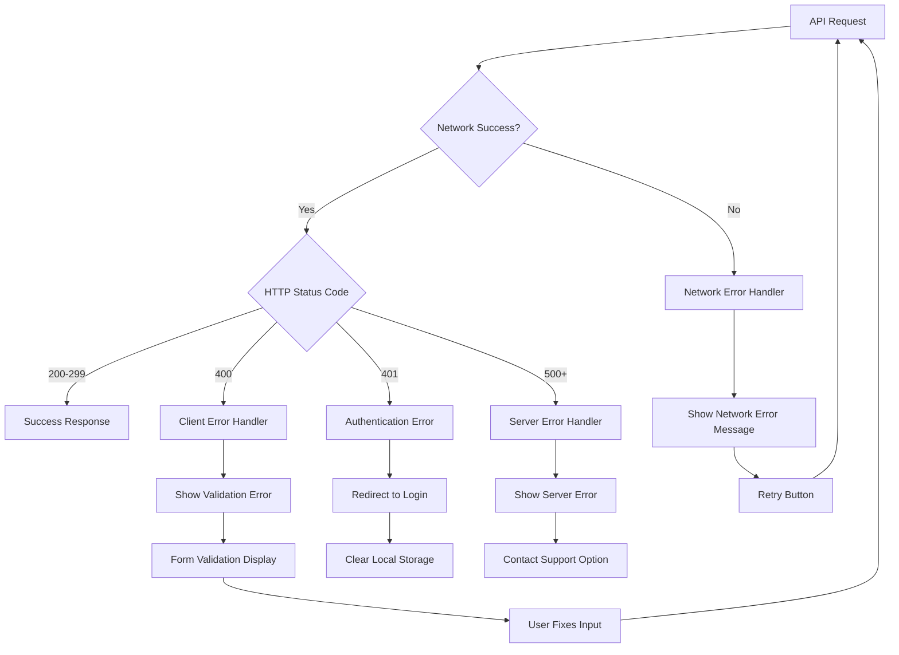
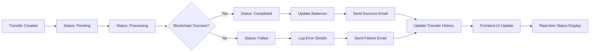

# 🔄 Transfer Flow: Frontend to Backend

## 📱 Frontend Transfer Page Flow

## 🔌 API Integration Layer

## 🚀 Backend Transfer Processing

## 📊 Data Flow Architecture

## 🔐 Security & Validation Flow

## 📱 Mobile-Specific Features

## 🔄 Error Handling & Recovery

## 📈 Transfer Status Tracking

## 🎯 Key Integration Points

### **Frontend → Backend**
- **API Base URL**: `http://localhost:4000/api`
- **Authentication**: Bearer token in Authorization header
- **Content-Type**: `application/json`
- **Error Handling**: Structured error responses

### **Backend → Frontend**
- **Response Format**: `{success, message, data}`
- **HTTP Status Codes**: 200, 400, 401, 500
- **Real-time Updates**: Transfer status polling
- **Balance Refresh**: Automatic after successful transfers

### **Data Validation**
- **Frontend**: Basic input validation
- **Backend**: Comprehensive business logic validation
- **Database**: Schema-level constraints
- **API**: Request/response type safety

## 🚀 Performance Optimizations

- **Lazy Loading**: Transfer history pagination
- **Caching**: Token balances in context
- **Debouncing**: API calls for real-time updates
- **Error Boundaries**: Graceful error handling
- **Loading States**: User feedback during operations

---

*This flowchart represents the complete transfer flow from user input to backend processing and back to frontend updates.*
